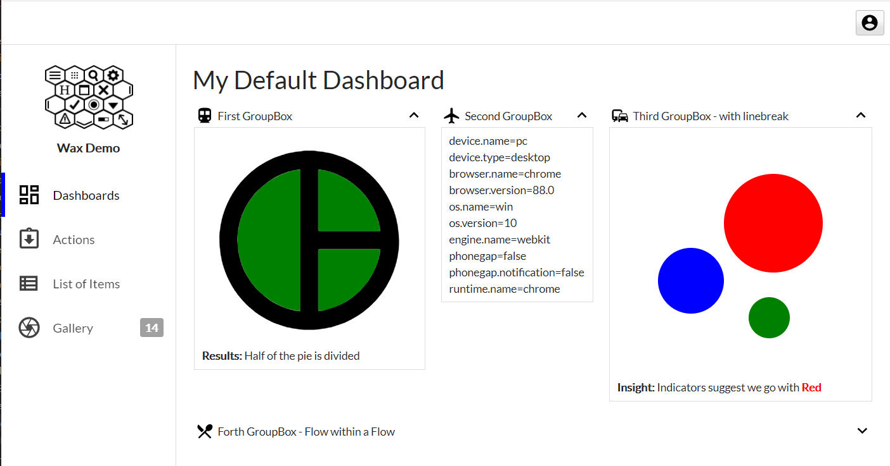
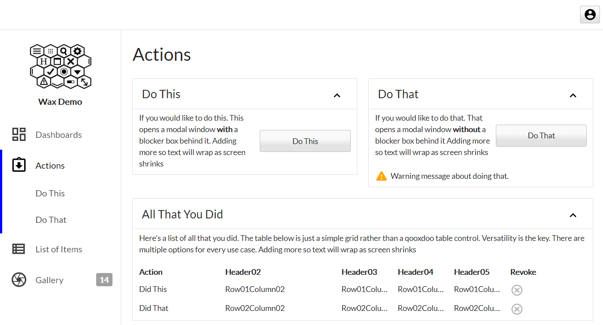
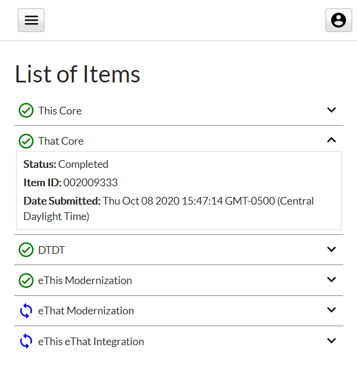

<!-- PROJECT LOGO -->
<br />
<p align="center">
  <a href="https://github.com/sqville/ville.GroupBox">
    
  </a>

  <h3 align="center"></h3>

  <p align="center">
    A collapsable groupbox control for the Qooxdoo JavaScript Framework
  </p>
</p>

<!-- ABOUT THE PROJECT -->
## About The Project

**ville.GroupBox** is a [Qooxdoo](https://qooxdoo.org/) desktop ui control. It brings a collapsable feature to the standard GroupBox control, and is designed to function across all screen sizes. 

**Screen Shots**





<!-- GETTING STARTED -->
## Using the Control in your Application
To use the control in your application, go into the application root directory and install the library into your project:
```sh
$ qx package update
$ qx package list
$ qx package install sqville/ville.GroupBox
```
to use the control as intended you must include Theme classes into your applications current theme. Include the two lines below at the top of your applications main function:
```sh
qx.Theme.include(qx.theme.manager.Appearance.getInstance().getTheme(), ville.groupbox.Appearance);
qx.Theme.include(qx.theme.manager.Decoration.getInstance().getTheme(), ville.groupbox.Decoration);
```

<!-- DEMOS -->
## Demo

See this control in action using the [Wax Demo App](https://sqville.github.io/ville.GroupBox/published/) 

<!-- ROADMAP -->
## Roadmap

TBD


<!-- LICENSE -->
## License

Distributed under the MIT License. See `LICENSE` for more information.


<!-- CONTACT -->
## Contact

Chris Eskew - [@SQville](https://twitter.com/SQville) - email: sqville@gmail.com